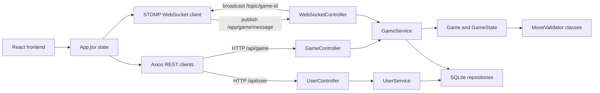

# About project

Project is a full-stack web chess application. The backend owns the chess
rules and game state, while the frontend provides a browser-based board,
timers, invite-code game creation, joining games, draw offers, resignation, and
real-time updates over WebSockets.

## Features

- Browser chess board with drag-and-drop moves
- Server-side move validation
- Special move support: castling, promotion, and en passant
- Invite-code game creation and joining
- Guest users and registered users
- Timers with increment support
- Draw offers, draw responses, and resignation
- Game history persistence in SQLite
- Real-time updates with STOMP over WebSocket
- Structured backend error responses
- Backend unit tests for chess rules and services

## Tech Stack

- Backend: Java 21, Spring Boot 3.4, Spring Web, Spring WebSocket,
  Spring Security, JUnit 5, Mockito
- Frontend: React 19, Vite 6, ESLint
- Realtime: STOMP over WebSocket
- Database: SQLite through JDBC
- Serialization: Jackson
- Build tools: Maven and npm

## Project Structure

```text
Backend/
  src/main/java/com/example/ChessProject/
    controller/          REST and WebSocket controllers
    controller/dto/      API response/request DTOs
    data/                SQLite repositories and connector
    model/               Board, game state, pieces, moves, timers
    model/validators/    Piece-specific move validators
    service/             Game, user, timer, and history services

Frontend/
  src/
    API/                 REST and WebSocket clients
    assets/pieces/       SVG chess pieces
    components/          UI components
```

## Architecture



The frontend uses REST for user actions, game creation, and joining by invite
code. Once a game is open, moves and game actions are sent through STOMP over
WebSocket. The backend validates the action, updates the authoritative game
state, and broadcasts a fresh `GameResponse` to every subscribed browser.


## Requirements

- JDK 21 or newer
- Maven
- Node.js 20 or newer
- npm


## Run Locally

Start the backend:

```powershell
cd Backend
mvn spring-boot:run
```

The backend runs on:

```text
http://localhost:8080
```

Install and start the frontend:

```powershell
cd Frontend
npm install
npm run dev -- --host 127.0.0.1 --port 5174
```

Open:

```text
http://127.0.0.1:5174
```

## Playing With A Friend

The app works locally first: both players can use the same machine/browser or
two browsers pointed at the same local frontend. To play from different
computers, the friend must be able to reach both:

- the frontend, usually port `5174`
- the backend REST/WebSocket server, port `8080`

The current code still has local URLs in the frontend:

- `VITE_API_BASE_URL` defaults to `http://localhost:8080`
- `VITE_WS_URL` defaults to `ws://localhost:8080/ws`

For internet play, these values must point to the public backend tunnel URL,
not to `localhost`.

### Same Wi-Fi / LAN

This is the simplest private setup.

1. Find the host computer's local IP address, for example `192.168.1.20`.
2. Start the backend on the host computer:

   ```powershell
   cd Backend
   mvn spring-boot:run
   ```

3. Start the frontend so other devices can reach it:

   ```powershell
   cd Frontend
   npm run dev -- --host 0.0.0.0 --port 5174
   ```

4. Change frontend API URLs from `localhost` to the host IP:

   ```text
   http://192.168.1.20:8080
   ws://192.168.1.20:8080/ws
   ```

5. Add the frontend origin to backend CORS/WebSocket allowed origins:

   ```text
   http://192.168.1.20:5174
   ```

6. Your friend opens:

   ```text
   http://192.168.1.20:5174
   ```

This may require allowing ports `5174` and `8080` through the host firewall.

### Public Link With A Tunnel

For a quick internet-accessible demo, use a tunneling tool such as ngrok or
Cloudflare Tunnel. You need two public URLs:

- one tunnel for the frontend on `5174`
- one tunnel for the backend on `8080`

The backend already allows local development origins and common temporary
tunnel domains:

```text
https://*.ngrok-free.app
https://*.trycloudflare.com
```

If you use another tunnel provider or a custom domain, add it to:

```properties
app.cors.allowed-origin-patterns=...
```

#### Example With Cloudflare Tunnel

Terminal 1, start the backend:

```powershell
cd Backend
mvn spring-boot:run
```

Terminal 2, expose the backend:

```powershell
cloudflared tunnel --url http://localhost:8080
```

Copy the public backend URL from the output, for example:

```text
https://backend-example.trycloudflare.com
```

Create `Frontend/.env.local`:

```env
VITE_API_BASE_URL=https://backend-example.trycloudflare.com
VITE_WS_URL=wss://backend-example.trycloudflare.com/ws
```

Terminal 3, start the frontend:

```powershell
cd Frontend
npm run dev -- --host 0.0.0.0 --port 5174
```

Terminal 4, expose the frontend:

```powershell
cloudflared tunnel --url http://localhost:5174
```

Send your friend the public frontend URL. Both players should open the same
frontend URL, then one player creates a game and shares the invite code.

#### Example With ngrok

Terminal 1:

```powershell
cd Backend
mvn spring-boot:run
```

Terminal 2:

```powershell
ngrok http 8080
```

Create `Frontend/.env.local` with the ngrok backend URL:

```env
VITE_API_BASE_URL=https://backend-example.ngrok-free.app
VITE_WS_URL=wss://backend-example.ngrok-free.app/ws
```

Terminal 3:

```powershell
cd Frontend
npm run dev -- --host 0.0.0.0 --port 5174
```

Terminal 4:

```powershell
ngrok http 5174
```

Send the frontend ngrok URL to your friend.

This is convenient for demos, but it is not a production deployment.

### Proper Deployment

For a cleaner long-term setup:

- build the frontend with `npm run build`
- serve the frontend from a static host
- deploy the Spring Boot backend to a server
- configure frontend API URLs through environment variables
- configure backend allowed origins through application properties
- use HTTPS and secure WebSockets (`wss://`)

## Tests

Run backend tests:

```powershell
cd Backend
mvn test
```

Run frontend checks:

```powershell
cd Frontend
npm run lint
npm run build
```

Current known frontend lint note: `Chessboard.jsx` exports both a React
component and a helper function, so Vite's Fast Refresh ESLint rule emits a
warning. The build still succeeds.

## Development Notes

- The backend logs through Spring Boot's SLF4J/Logback logging stack.
- API errors use a structured response body with fields such as `code`,
  `message`, `status`, `path`, and `timestamp`.
- The project currently permits all Spring Security requests; production-ready
  authentication is not yet implemented.
