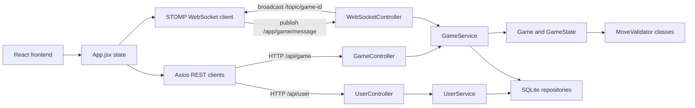

# About project

Project is a full-stack web chess application. The backend owns the chess
rules and game state, while the frontend provides a browser-based board,
timers, invite-code game creation, joining games, draw offers, resignation, and
real-time updates over WebSockets.

## Features

- Browser chess board with drag-and-drop moves
- Server-side move validation
- Special move support: castling, promotion, and en passant
- Invite-code game creation and joining
- Guest users and registered users
- Timers with increment support
- Draw offers, draw responses, and resignation
- Game history persistence in SQLite
- Real-time updates with STOMP over WebSocket
- Structured backend error responses
- Backend unit tests for chess rules and services

## Tech Stack

- Backend: Java 21, Spring Boot 3.4, Spring Web, Spring WebSocket,
  Spring Security, JUnit 5, Mockito
- Frontend: React 19, Vite 6, ESLint
- Realtime: STOMP over WebSocket
- Database: SQLite through JDBC
- Serialization: Jackson
- Build tools: Maven and npm

## Project Structure

```text
Backend/
  src/main/java/com/example/ChessProject/
    controller/          REST and WebSocket controllers
    controller/dto/      API response/request DTOs
    data/                SQLite repositories and connector
    model/               Board, game state, pieces, moves, timers
    model/validators/    Piece-specific move validators
    service/             Game, user, timer, and history services

Frontend/
  src/
    API/                 REST and WebSocket clients
    assets/pieces/       SVG chess pieces
    components/          UI components
```

## Architecture



The frontend uses REST for user actions, game creation, and joining by invite
code. Once a game is open, moves and game actions are sent through STOMP over
WebSocket. The backend validates the action, updates the authoritative game
state, and broadcasts a fresh `GameResponse` to every subscribed browser.


## Requirements

- JDK 21 or newer
- Maven
- Node.js 20 or newer
- npm


## Run Locally

Start the backend:

```powershell
cd Backend
mvn spring-boot:run
```

The backend runs on:

```text
http://localhost:8080
```

Install and start the frontend:

```powershell
cd Frontend
npm install
npm run dev -- --host 127.0.0.1 --port 5174
```

Open:

```text
http://127.0.0.1:5174
```

## Playing With A Friend

The current code has local URLs in the frontend:

- `VITE_API_BASE_URL` defaults to `http://localhost:8080`
- `VITE_WS_URL` defaults to `ws://localhost:8080/ws`

For internet play, these values must point to the public backend tunnel URL,
not to `localhost`.

### Public Link With Cloudflare Tunnel

For remote gameplay, you can use Cloudflare Tunnel. There are two
different tunnels because there are two different things to expose:

- the backend tunnel exposes the API and WebSocket server on `8080`;
- the frontend tunnel exposes the Vite page on `5174`.

Put the **backend tunnel URL** in `Frontend/.env.local`. Send the
**frontend tunnel URL** to the other player.

Terminal 1, start the backend:

```powershell
cd Backend
mvn spring-boot:run
```

Terminal 2, expose the backend:

```powershell
cloudflared tunnel --url http://localhost:8080
```

Copy the public backend URL from the output, for example:

```text
https://backend-example.trycloudflare.com
```

Create `Frontend/.env.local`:

```env
VITE_API_BASE_URL=https://backend-example.trycloudflare.com
VITE_WS_URL=wss://backend-example.trycloudflare.com/ws
```

Use the real URL printed by `cloudflared`, not `backend-example`. For example,
if the backend tunnel prints:

```text
https://showers-acute-cowboy-machines.trycloudflare.com
```

then `Frontend/.env.local` should be:

```env
VITE_API_BASE_URL=https://showers-acute-cowboy-machines.trycloudflare.com
VITE_WS_URL=wss://showers-acute-cowboy-machines.trycloudflare.com/ws
```

Terminal 3, start the frontend:

```powershell
cd Frontend
npm run dev -- --host 0.0.0.0 --port 5174
```

Terminal 4, expose the frontend:

```powershell
cloudflared tunnel --url http://localhost:5174
```

Copy the frontend tunnel hostname from Terminal 4, without `https://`, and add
it to `Frontend/vite.config.js`. Vite blocks unknown public hosts unless they
are listed in `server.allowedHosts`.

For example, if the frontend tunnel is:

```text
https://retrieval-inspections-mega-mixed.trycloudflare.com
```

then `Frontend/vite.config.js` should contain:

```js
export default defineConfig({
  plugins: [react()],
  server: {
    port: 5174,
    allowedHosts: [
      'retrieval-inspections-mega-mixed.trycloudflare.com'
    ]
  }
})
```

After changing `vite.config.js`, restart the frontend dev server from Terminal
3.

Copy the frontend tunnel URL from Terminal 4 and send that URL to your friend.
Both players open the frontend tunnel URL in a browser. One player creates a
game and shares the invite code with the other player.

Keep all four terminals running while you play. If you stop either
`cloudflared` process and start it again, it creates a new public URL. If the
backend tunnel changes, update `Frontend/.env.local` and restart the frontend
dev server.

This is convenient for demos, but it is not a production deployment.

### Proper Deployment

For a cleaner long-term setup:

- build the frontend with `npm run build`
- serve the frontend from a static host
- deploy the Spring Boot backend to a server
- configure frontend API URLs through environment variables
- configure backend allowed origins through application properties
- use HTTPS and secure WebSockets (`wss://`)

## Tests

Run backend tests:

```powershell
cd Backend
mvn test
```

Run frontend checks:

```powershell
cd Frontend
npm run lint
npm run build
```

## Development Notes

- The backend logs through Spring Boot's SLF4J/Logback logging stack.
- API errors use a structured response body with fields such as `code`,
  `message`, `status`, `path`, and `timestamp`.
- The project currently permits all Spring Security requests; production-ready
  authentication is not implemented.
